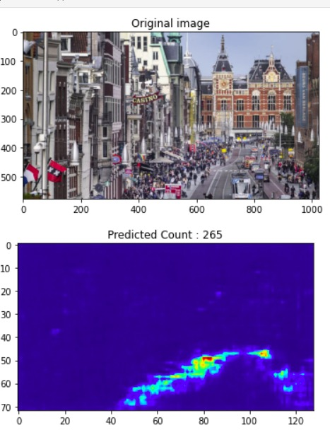

# Few-shot learning for fast scene adaptation of crowd counting models.
Suppose we wish to count the number of people in an image taken with a surveillance camera. The usual approach would be to place the camera, annotate a large number of images, and then train a model on these images. One issue here is that annotating images (in this case, placing dots on the heads of people) is a time-consuming endeavour. This project is about alleviating this issue a bit by using few-shot learning techniques. Few-shot learning in the context of crowd counting is to adapt a crowd counting model to a novel camera scene using minimal (1 to 5, or sometimes even 0) annotated training examples. As such, we as the municipality would no longer be required to annotate a large number of images whenever we place a new camera.


A trained model must be able to produce a 'density map' of the image. In this density map, the head of each person should be represented as a probability distribution summing to one. Integrating over the complete density map should then yield the number of people in the image. As an example, we can look at the image below. The top image is a picture of one of the streets in Amsterdam, and the bottom image is the produced density map generated by a pre-trained model. As indicated by the title, when summing all the pixel values in the density map, the model predicts a total person count of 265 (this number is always non-negative, though it is not always an integer).



---


## Project Folder Structure

This project is a modification of the Crowd Counting Code (C^3) framework: [https://github.com/gjy3035/C-3-Framework](https://github.com/gjy3035/C-3-Framework)
There are the following folders in the structure:

[`datasets`](./datasets): In this folder, several datasets (some preprocessed) can be downloaded from the original authors of the C^3 framework. This folder also contains some scripts to generate the ground truth yourself, albeit with matlab scripts.<br/>
[`misc`](./misc): Some miscellaneous and utility functions.<br/>
[`models`](./models): The architectures of various crowd counting models.<br/>
[`results_reports`](./results_reports): Settings of previous experiments are listed here. If you wish to reproduce results, please use these settings.<br/>

[`resources`](./resources): Random nice resources, e.g. [`useful links`](./resources/links.md)<br/>
[`src`](./src): Folder for all source files specific to this project<br/>
[`media`](./media): Folder containing media files (icons, video)<br/>

---


## Installation
This project was tested to work on Windows 10. The original C3Framework worked on Linux, though this adaptation is not tested yet.

1) Clone this repository:
    ```bash
    git clone https://github.com/Amsterdam-Internships/InternshipAmsterdamGeneral
    ```
    
    
    ```bash
    git clone https://github.com/Amsterdam-Internships/InternshipAmsterdamGeneral
    ```
    
    

2) Install all dependencies in requirements.txt

2 (alternative) Install the environment with conda. This is a complete export of the environment used to perform the experiments:
    ```bash
    git clone https://github.com/Amsterdam-Internships/InternshipAmsterdamGeneral
    ```


## Usage

Explain example usage, possible arguments, etc. E.g.:

To train... 


```
$ python train.py --some-importang-argument
```

---


## How it works

Explain roughly how the code works, what the main components are, how certain crucial steps are performed...

---
## Acknowledgements


Don't forget to acknowledge any work by others that you have used for your project. Add links and check whether the authors have explicitly stated citation preference for using the DOI or citing a paper or so. 
For example:

Our code uses [YOLOv5](https://github.com/ultralytics/yolov5) [](https://zenodo.org/badge/latestdoi/264818686)

